## reWorked: Питер / 17.02.2024
### Контракты API. Писать вручную нельзя генерить

## Щербаков Алексей
я, Алексей Щербаков - тимлид кросс функциональной команды, фронтенд разработчик.

<!-- 

Организаторы решили порофлить над тем, что я тёска с комиком Алексеем Щербаковым.
От туда вся тень на плятень.
Однако кто из вас реально ожидал увидеть комика с докладом про контракты и прочее мракобесие?

> согласен, но чтобы хоть как-то оправдать заход начну с рассказа о том, как я сюда попал
 -->

-----

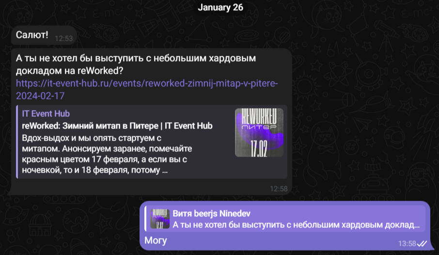

<!-- 
приглашение

На одном из beerjs, самом лучшем drinkup сообществе SPB
Рекламная вставка: BeerJs spb, самые душевные дринкапы СПБ
Меня спрашивали про Rework, мой ответ был что нет денег и времени

И вот, спустя некоторое время Витя, публично аффелированный с Rework пишет и приглашает на Reworked
с бесплатной проходкой.

И тут я преисплолнился, думаю, ага, вот первое приглашенеи в качестве докладчика.
Не просто прошу, присмыкаюсь и доказываю значимость своей темы, а люди сами предлагают

 -->

----

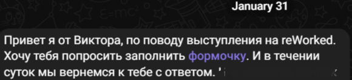

<!-- 
не всё так просто
Тут внезапно оказалось что райдер со скидками, прочим преждевременнен
Да, я не так хорош как мне казалось.
 -->

## и всё-таки я здесь =)

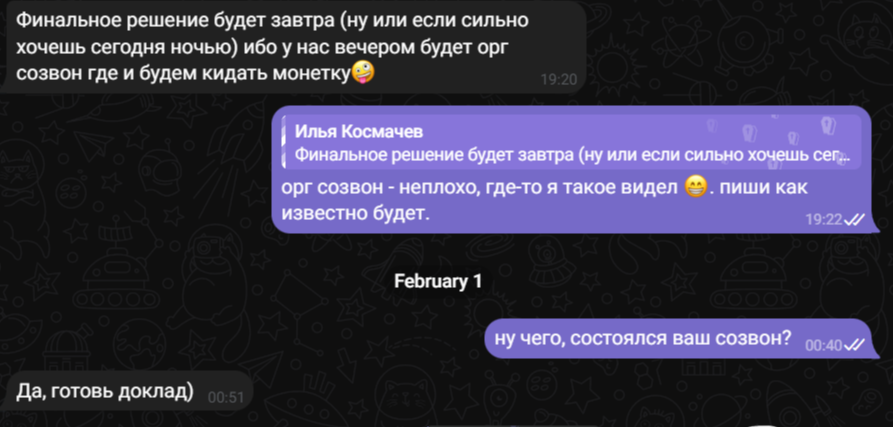

<!-- 

Уж не знаю что на вибросозвонах оргов происходит, но надеюсь решающим оказалась харизма и опыт.
А совсем не тёскость =)
На этой ноте перейду к основной теме доклада.

 -->

## ❓ Вопрос ❓
### Используете контрактную разработку

### поднимите руку ✋, если Да

## Контракты - важно, на реальном примере
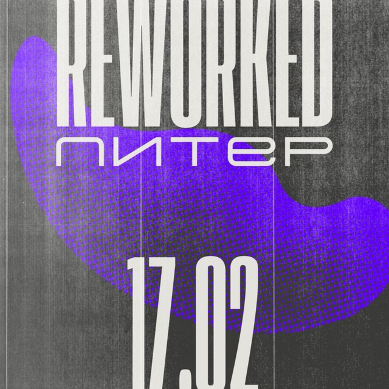

<!-- 
Мини ликбез почему это я считаю что контракты вообще важны.
В моём примере организаторы reWorked это вендор, реализующий ценность для потребителя.
Потребитель в нашем случае обобщённо это все посетители конференции.
Вендор предоставляет некоторые интерфейсы по реализации наших бизнес-потребностей, в частности:
- покушать
- прибухнуть
- посмотреть кинцо и погорланить 
 -->

## Сбор постановки на публичный контракт "прибухнуть"

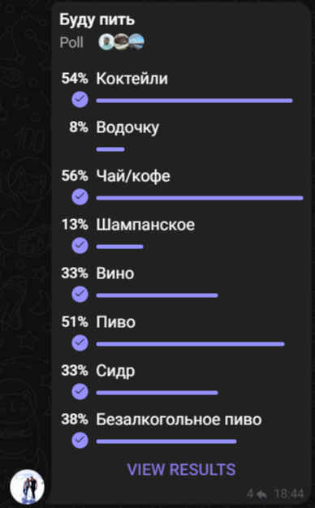

<!-- значит нам нужна сначала спецификация, ревью , затем реализация -->

## волшебная палочка

* собрать людей
* по запросу добавлять тот или иной алкоголь
* потерять актуальность, потратиться на логистику
* не знаем о рисках до интеграции, доставки ценности

<!-- 
несмотря на все минусы всё-таки волшебная палочка неплоха.

однако есть неочевидные вещи, которые можно обработать, или по крайней мере выявить на этапе описания контракта "прибухнуть"

 -->
----

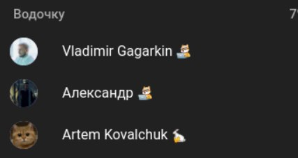

<!-- 
Ага, видим зону риска
 -->

## анализ пожеланий на контракт
|кто|Коктейли| Водочку| Вино| Пиво|
|----|----|----|----|----|
|Владимир|+|+|+|+|
|Александр| +|+|+|+|
|Артём |+||||+|

<!-- 
Ага, видим зону риска. Подсказка - за этими ребятами стоит присмотреть.

Предтавленная аналитика предназначена для радостного кеканья, не для продажи
 -->

----

|кто|Коктейли| Водочку| Вино| Пиво|Сидр|Безалкогольное пиво
|----|----|----|----|----|----|----|
|Щербаков|+|-|+|+|+|+|

<!-- 

вообще я бы к этому парню тоже присмотрелся

 -->

## Писать вручную нельзя, генерить

* ⚒ мета информация в исходном коде
  * примеры swagger плагинов: @nestjs/swagger, io.swagger.swagger-annotations
* ⚛ анализ исходников
  * разбор
  * преобразование в промежуточный формат ( например ast )
  * генерация из него
* 🤷‍♂️ мета программирование (чтобы из наших инструкций получался и исполняемый код и спецификация)

----

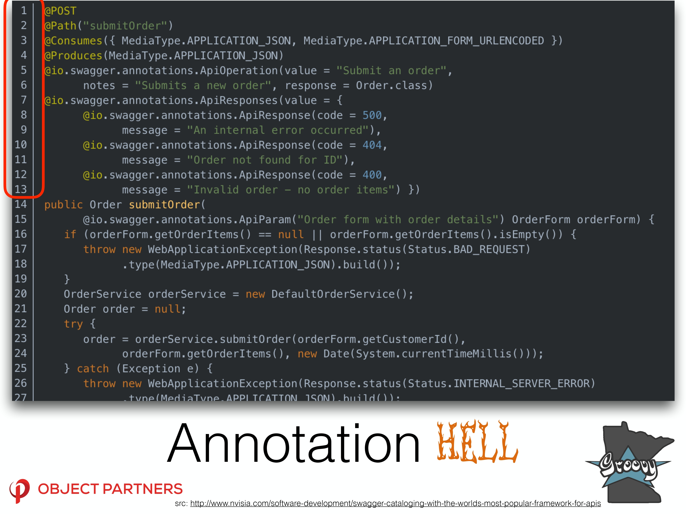

<!-- 
Я впринципе не люблю аннотации в java т.к. не зная скрытую в них логику ты натыкаешься на магические контексты, их мутацию и сайд эффекты.

Но не об этом речь.

На сдайде представлен тривиальный кейс, его можно улучшить скажем вынесением в интерфейс и описанием нотация для swagger только там.

Но в реальной жихни этих самых аннотаций для одного метода будет примерно на экран для одного метода.

Но это не самое неприятное, самое неприятное это отсутствие в большинстве случаев привязки к рантайму, т.е. фактически мы описываем всё руками, но в коде с некоторыми ограничениями.

Перейдём к итогам, где я обобщу преимущества и недостатки использования подобного подхода в рамках обозначенных ранее инструментов.

 -->

## Итого

* 😊🤔проще держать в актуальном состоянии
* 😒 нужно уметь кодить
* 😒 привязка не к спецификации, а к конкретным библиотекам
* 😒в сложных кейсах сложно

## Писать вручную, нельзя генерить

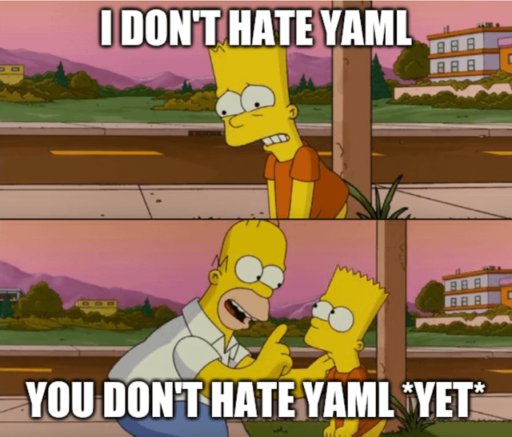

----

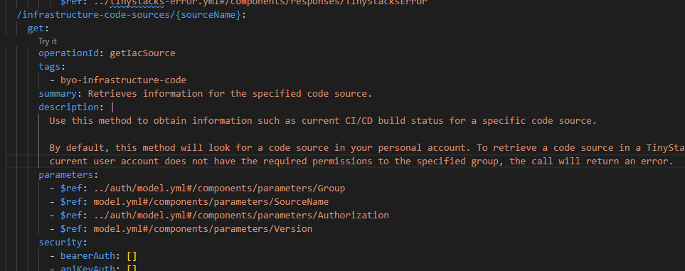

<!-- 
вот такое описание api в yaml, при чём описание полноценного endpoint это ещё X3 текста и знания возможностей спецификации
 -->

## Итого
* 😊 не надо уметь кодить
* 😊 спека справедлива для любой технологии на которой написан API
* 😊 можно и нужно пользоваться возможностями
* 🤮 too complex yaml / json (ну это совсем изврат)

## ❓ Вопрос ❓
### Используете контрактную разработку

### поднимите руку ✋, если Да

## Мой вывод, но возможно не ваш =)

* в моей кроссфункциональной команде есть backend-frontend-qa -> писать руками
* я не хочу +1 актуализацию и решения проблем тулинга -> писать руками
* знание де-факто стандартной спеки - базовое знание -> писать руками

## Итоговый итог, у каждого свой

Ответы на вопросы для принятия решения
* однородный ли стек?
* хочется ли и можется ли поддерживать прослойку?
* в перспективе нескольких лет ничего не поменяется?

<!-- 
с контактами до реализации или доставки ценностей лучше чем без них
чтобы сделать выбор нужно ответить себе на ряд вопросов
 -->

---

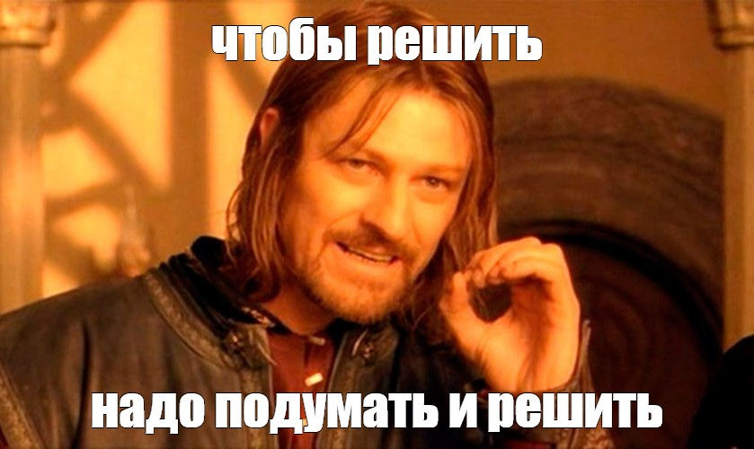

<!-- 

По итогу свою запятую вы поставите сами =)
 -->

## #БЛАГОДАРОЧКИ
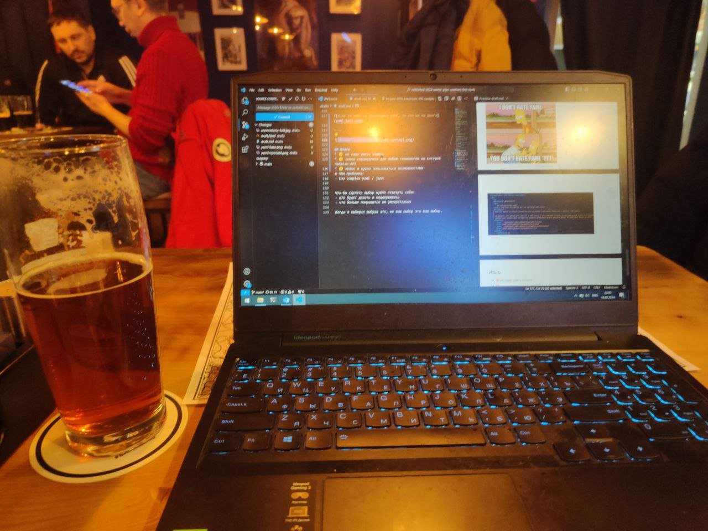

<!-- 

Спасибо оргам, что пригласили

Спасибо моей семье, в пятницу вечером вместо совместного припровождения сидел в баре корпел над докладом

Спасибо бару за пик балмера

За нулевую и единственную итерацию прогонов центру обучения Nexign, в частности Кулебякиной Татьяне, ей мы обязаны общей структурой содержательной части доклада.

 -->

## ❓ Самый важный вопрос жизни и всего на свете ❓
### Знаете ли вы кто такой Паша "Техник"

### поднимите руку ✋, если Да

<!-- Ок, теперь я знаю с кем стоит пообщаться а с кем нет -->

## QnA
- TG: @alexey_shcherbakov
- GH: https://github.com/akaguny/