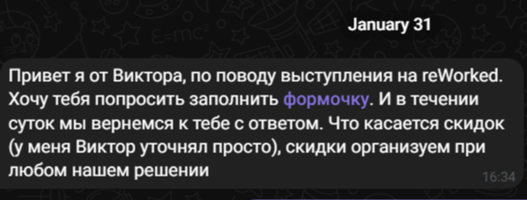

# 2.1 draft pres reworked

## представление
я, Алексей Щербаков - тимлид кросс функциональной команды, фронтенд разработчик.

<!-- 

Организаторы решили порофлить над тем, что я тёска с комиком Алексеем Щербаковым.
От туда вся тень на плятень.
Однако кто из вас реально ожидал увидеть комика с докладом про контракты и прочее мракобесие?

> согласен, но что-бы хоть как-то оправдать заход начну с рассказа о том, как я сюда попал
 -->

## приглашение

<!-- 

На одном из beerjs, самом лучшем drinkup сообществе SPB
Рекламная вставка: BeerJs spb, самые душевные дринкапы СПБ
Меня спрашивали про Rework, мой ответ был что нет денег и времени
И вот, спустя некоторое время Витя, публично аффелированный с Rework пишет и приглашает на Reworked
с бесплатной проходкой.
И тут я преисплолнился, думаю, ага, вот первое приглашенеи в качестве докладчика.
Не просто прошу, присмыкаюсь и доказываю значимость своей темы, а люди сами предлагают

 -->

## не всё так просто

<!-- 

Тут внезапно оказалось что райдер со скидками, прочим преждевременнен
Да, я не так хорош как мне казалось.
 -->

## и всё-таки я здесь =)

<!-- 

Уж не знаю что на вибросозвонах оргов происходит, но надеюсь решающим оказалась харизма и опыт.
А совсем не тёскость =)
На этой ноте перейду к основной теме доклада.

 -->

## контрактная разработка это здорово и хорошо

юмор: про алкоголь с проблемами интеграции
пара аргументов

фото: фото имперца и трубочки для питья

значит нам нужна сначала спецификация, ревью , затем реализация

## волшебная палочка
вы конечно можете сказать что у вас всё чётко, сначала выполняется реализация одного модуля, затем второй подстраивается под него

но вам понадобится волшебная палочка по сбору спецификации из готовой реализации. Это хорошо, но может воткнутся не туда.

## руками править нельзя генерить из кода

дальше про генерацию из кода

принципиально это может быть:
- мета информация в исходном коде
  - пример swagger плагинов nestjs https://docs.nestjs.com/openapi/introduction, spring-boot)
- анализ исходников (разбор, преобразование в промежуточный формат ( например ast, генерация из него)
- мета программирование, чтобы из наших инструкций получался и исполняемый код и спецификация

на примерах java spring boot, nestjs

а зачем
- проще держать в актуальном состоянии
в чём проблема
- нужно уметь кодить
- привязка не к спецификации, а к конкретным библиотекам
- в сложных кейсах сложно

дальше про написание руками
- не надо уметь кодить
- спека справедлива для любой технологии на которой написан API
- можно и нужно пользоваться возможностями
в чём проблема:
- too complex yaml / json
- 

Что-бы сделать выбор нужно ответить себе:
- кто будет делать и поддерживать
- что больше понравится им умозрительно

Когда я выбирал выбрал это, но ваш выбор это ваш выбор.
